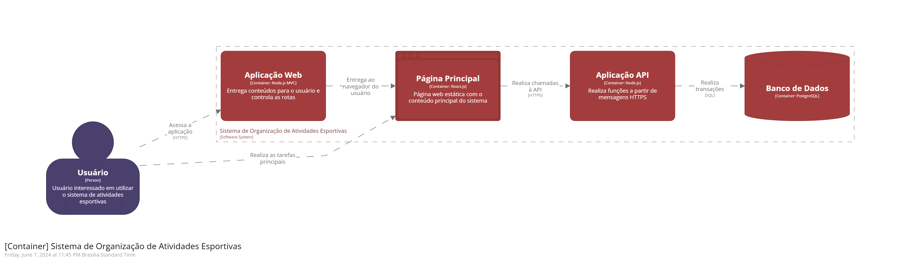

# Integrantes

Gabryel Rodrigues Alves da Silva - 235394

Pedro Henrique Antoine Cortez Daccache - 251572

Lawrence Francisco Martins de Melo - 223480

André Rodrigues Alves da Silva - 231392

# Descrição do Projeto

É comum que os alunos de uma escola participem anualmente do interclasses, que é uma competição de futebol entre as turmas. Mas, além do futebol, essa tradicional competição poderia englobar diversos outros esportes também, assim como ocorre nas olimpíadas. Baseado nisso, o software nesse repositório é um sistema de simulação e gerenciamento de olimpíadas para escolas. Esse sistema tem como objetivo principal auxiliar professores e orientadores a organizar um “interclasses olímpico” dentro de seus colégios, bem como fornecer uma plataforma intuitiva para os alunos e funcionários acompanharem os resultados das competições.

# Instalação

Instale a versão 20.12.2 (LTS) do [NodeJS](https://nodejs.org/en/download) e [npm](https://docs.npmjs.com/downloading-and-installing-node-js-and-npm) e a ultima versão do [Docker](https://docs.docker.com/engine/install/) para executar localmente o projeto.

Para instruções detalhadas de instalação, consulte o arquivo [INSTALL.md](./INSTALL.md)

# Arquitetura

## Padrão Arquitetural

O padrão arquitetural escolhido para o projeto foi o MVC (Model-View-Controller). Nesse padrão, as classes são organizadas em três grupos:

* Visão: apresentação da interface gráfica do sistema.
* Controladoras: tratam e interpretam eventos gerados por dispositivos de entrada.
* Modelo: armazenam os dados manipulados pela aplicação.

Esse padrão foi adotado porque, dentre outras vantagens, favorece a especialização do trabalho em desenvolvimento. Dessa forma, como o trabalho é feito em grupo, é possível que uma pessoa esteja preocupada em desenvolver a questão da interface gráfica por exemplo e a outra pessoa o armazenamento dos dados.

Cada grupo tem suas responsabilidades específicas e, com isso, fica mais simples pensar nos métodos e funções necessárias para implementar cada parte específica.

Por fim, como os objetos não são necessariamente visuais, fica mais fácil testar cada funcionalidade do sistema sem ter que necessariamente se preocupar com as apresentações dos mesmos.

## Diagrama C4 para a Arquitetura

O diagrama C4 é um diagrama baseado em 4 diagramas (de Contexto, de Container, de Componentes e de Código). Os dois primeiros diagramas foram feitos para auxiliar e complementar o diagrama de nível 3 (de componentes) que é o foco da atividade.

### Diagrama de Contexto do Sistema (nível 1)

O foco principal desse diagrama é mostrar os usuários e como eles interagem com os diferentes sistemas do software. Devido à pequena complexidade arquitetural desse projeto, esse diagram contém apenas um usuário (que pode ser tanto o professor quanto o aluno) interagindo com o sistema.

### Diagrama de Container (nível 2)

Esse segundo diagrama é como um zoom-in do diagrama anterior. O container mostra, em alto nível, o formato da arquitetura do software e como as responsabilidades são distribúidas nele. Aqui também são mostradas algumas tecnologias que são utilizadas e como os containers se comunicam.

### Diagrama de Componentes (nível 3)

Para esse diagrama, é feito um zoom-in para cada componente do diagrama de container. Nesse caso, foram detalhadas as componentes da `Aplicação API` e do `Banco de Dados`. Para cada componente, é importante ressaltar o que exatamente elas são, suas responsabilidades e os detalhes das tecnologias utilizadas e da implementação.

#### Detalhamento Componente 1 - Aplicação API

No estado atual do código, a aplicação API conta com alguns models e controllers. Esses controllers têm responsabilidades específicas relacionadas a olimpíadas ou ao gerenciamento de usuários, com base nos modelos específicos. Esses modelos, por sua vez, são responsáveis pela conexão com o banco de dados.

#### Detalhamento Componente 2 - Banco de Dados

Detalhando o banco de dados, é possível verificar dois componentes principais: o gestor de conexões (aplicado com o padrão de projeto Singleton e responsável por gerenciar o pool de conexões) e o banco principal (onde os dados são efetivamente armazenados).

### Visualização completa

O diagrama completo é mostrado a seguir:

